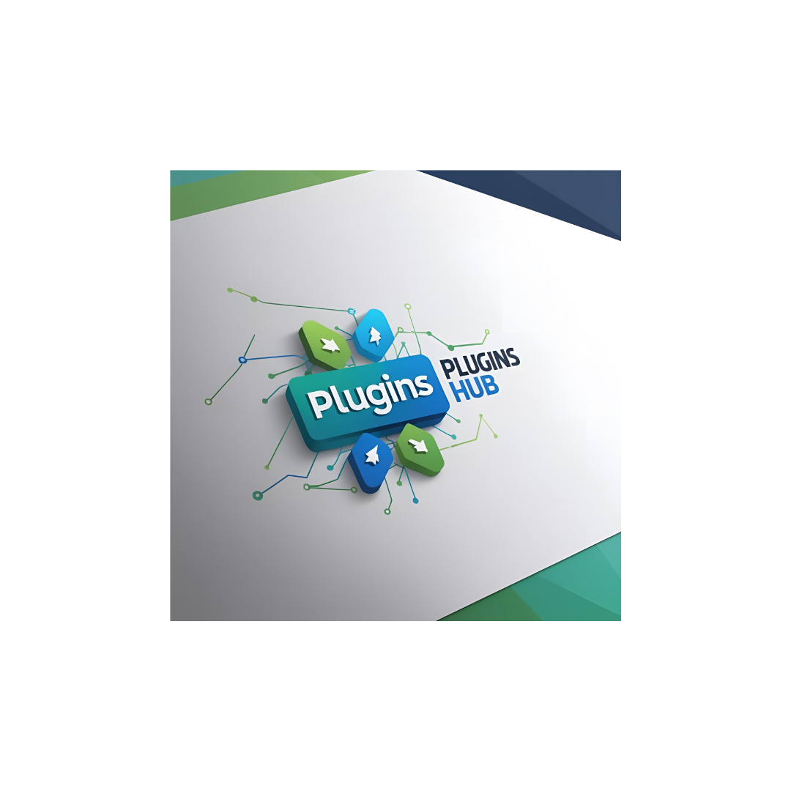

# Plugins Hub 🧩



## 🚀 Live Demo

[**Visit Plugins Hub**](https://v0-vercel-website-project-umber.vercel.app/)

## 📋 Overview

Plugins Hub is a cutting-edge e-commerce marketplace for high-quality developer plugins and tools. Built with Next.js and deployed on Vercel, this platform connects developers with premium plugins to enhance their projects and streamline their development workflow.

## ✨ Features

- **Responsive Design**: Fully responsive interface that works seamlessly across desktop, tablet, and mobile devices
- **Product Catalog**: Browse a diverse collection of developer plugins with detailed descriptions
- **Category Filtering**: Filter plugins by category, price range, and ratings
- **Product Details**: Comprehensive product pages with features, requirements, and user reviews
- **Shopping Cart**: Add products to cart, update quantities, and proceed to checkout
- **User Authentication**: Secure login and registration system
- **Kenya Shillings Support**: All prices displayed in KES with proper formatting
- **Contact Form**: Easy-to-use contact form with validation
- **SEO Optimized**: Built with SEO best practices for better visibility

## 🛠️ Technologies

- **Frontend**: Next.js 14, React, HTML, Typescript
- **Styling**: Tailwind CSS, shadcn/ui components
- **State Management**: React Context API
- **Form Validation**: Zod
- **Deployment**: Vercel
- **Icons**: Lucide React

## 📦 Installation

Follow these steps to set up the project locally:

```bash
# Clone the repository
git clone https://github.com/254Manuell/FINAL-feb-2025-final-project-and-deployment-254Manuell.git 

# Navigate to the project directory
cd plugins-hub

# Install dependencies
npm install

# Start the development server
npm run dev